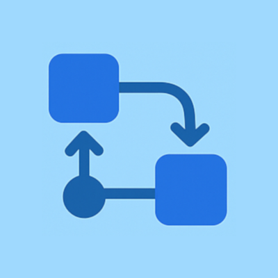

# Flowlytics

<div align="center">
  
</div>

**Herramientas de Análisis Empresarial desarrolladas con Flutter**

Flowlytics es una aplicación móvil y de escritorio que proporciona herramientas esenciales para el análisis estratégico empresarial. Diseñada para emprendedores, consultores y equipos de negocio que necesitan estructurar y visualizar sus ideas de manera profesional.


## ✨ Características Principales

- 🎨 **Interfaz Intuitiva**: Diseño moderno y fácil de usar
- 💾 **Guardado Automático**: Tu progreso se guarda automáticamente
- 🌐 **Multiidioma**: Soporte para Español e Inglés
- 📱 **Multiplataforma**: Funciona en Android, iOS, Windows, macOS y Linux
- 🎯 **Herramientas Especializadas**: 5 canvas empresariales diferentes

## 🛠️ Herramientas Incluidas

### 1. Business Model Canvas
Diseña y visualiza tu modelo de negocio con los 9 bloques fundamentales:
- Propuesta de Valor
- Segmentos de Clientes
- Canales
- Relación con Clientes
- Flujos de Ingresos
- Recursos Clave
- Actividades Clave
- Socios Clave
- Estructura de Costos

### 2. Análisis FODA/SWOT
Evalúa factores internos y externos de tu organización:
- **Fortalezas** (Strengths)
- **Oportunidades** (Opportunities)
- **Debilidades** (Weaknesses)
- **Amenazas** (Threats)

### 3. Value Proposition Canvas
Define tu propuesta de valor única:
- Mapa de Valor
- Perfil del Cliente
- Ajuste Producto-Mercado

### 4. Team Canvas
Estructura y dinamiza tu equipo:
- Propósito del Equipo
- Roles y Responsabilidades
- Valores y Normas
- Objetivos y Métricas

### 5. Idea Napkin Canvas
Captura y valida ideas de negocio de forma rápida:
- Problema/Oportunidad
- Solución
- Mercado Objetivo
- Competencia
- Modelo de Negocio

## 🚀 Instalación y Configuración

### Prerrequisitos

- Flutter SDK 3.9.2 o superior
- Dart SDK
- Android Studio / VS Code
- Git

### Configuración del Entorno

1. **Clona el repositorio:**
```bash
git clone https://github.com/javert-galicia/flowlytics.git
cd flowlytics
```

2. **Instala las dependencias:**
```bash
flutter pub get
```

3. **Genera los archivos de localización:**
```bash
flutter gen-l10n
```

4. **Ejecuta la aplicación:**
```bash
flutter run
```

### Compilación para Producción

**Android:**
```bash
flutter build apk --release
```

**Windows:**
```bash
flutter build windows --release
```

**iOS:**
```bash
flutter build ios --release
```

## 📦 Dependencias Principales

| Paquete | Versión | Propósito |
|---------|---------|-----------|
| `flutter` | SDK | Framework principal |
| `flutter_localizations` | SDK | Internacionalización |
| `provider` | ^6.1.1 | Gestión de estado |
| `shared_preferences` | ^2.2.3 | Almacenamiento local |
| `reorderables` | ^0.6.0 | Elementos reordenables |
| `intl` | any | Formateo de fechas/números |

## 🏗️ Arquitectura del Proyecto

```
lib/
├── main.dart                 # Punto de entrada
├── l10n/                    # Internacionalización
│   ├── app_localizations.dart
│   ├── app_en.arb
│   └── app_es.arb
├── models/                  # Modelos de datos
│   ├── canvas_models.dart
│   ├── foda_models.dart
│   └── value_proposition_models.dart
├── pages/                   # Páginas de la aplicación
│   ├── home_page.dart
│   ├── business_model_canvas_page.dart
│   ├── foda_analysis_page.dart
│   ├── value_proposition_canvas_page.dart
│   ├── team_canvas_page.dart
│   └── idea_napkin_canvas_page.dart
├── providers/               # Gestión de estado
│   └── locale_provider.dart
├── theme/                   # Temas y estilos
│   └── app_theme.dart
└── widgets/                 # Componentes reutilizables
    ├── app_navigation_drawer.dart
    ├── canvas_section.dart
    ├── foda_section.dart
    ├── team_canvas_section.dart
    └── value_proposition_section.dart
```

## 🎨 Características de Diseño

- **Material Design 3**: Interfaz moderna y consistente
- **Tema Personalizado**: Colores y tipografía adaptados para herramientas empresariales
- **Fuente Lato**: Tipografía profesional y legible
- **Responsive**: Adaptable a diferentes tamaños de pantalla

## 🌐 Internacionalización

La aplicación soporta múltiples idiomas:
- 🇪🇸 **Español** (es)
- 🇺🇸 **Inglés** (en)

Los usuarios pueden cambiar el idioma desde la configuración de la aplicación.

## 💾 Persistencia de Datos

- **SharedPreferences**: Para configuraciones del usuario y preferencias
- **Guardado Automático**: Todos los canvas se guardan automáticamente mientras el usuario trabaja
- **Estado Persistente**: La aplicación recuerda el último estado de cada herramienta

## 🧪 Testing

Ejecuta las pruebas:
```bash
flutter test
```

## 📱 Capturas de Pantalla

[Aquí puedes agregar capturas de pantalla de la aplicación]

## 🤝 Contribución

¡Las contribuciones son bienvenidas! Si deseas contribuir:

1. Fork el proyecto
2. Crea una rama para tu feature (`git checkout -b feature/AmazingFeature`)
3. Commit tus cambios (`git commit -m 'Add some AmazingFeature'`)
4. Push a la rama (`git push origin feature/AmazingFeature`)
5. Abre un Pull Request

## 📋 Roadmap

- [ ] Exportación a PDF de los canvas
- [ ] Plantillas predefinidas
- [ ] Colaboración en tiempo real
- [ ] Integración con herramientas de productividad
- [ ] Modo oscuro
- [ ] Más idiomas (Francés, Portugués)

## 📄 Licencia

Este proyecto está bajo la Licencia GNU General Public License v3.0. Ver el archivo [LICENSE](LICENSE) para más detalles.

Esta licencia garantiza que el software permanezca libre y de código abierto, y que cualquier trabajo derivado también debe ser distribuido bajo los mismos términos.

## 👤 Autor

**Javier Galicia**
- GitHub: [@javert-galicia](https://github.com/javert-galicia)

## 🙏 Agradecimientos

- Flutter Team por el excelente framework
- Comunidad de desarrolladores Flutter
- Metodologías empresariales que inspiraron las herramientas

---

⭐ **¿Te gusta el proyecto? ¡Dale una estrella!** ⭐
